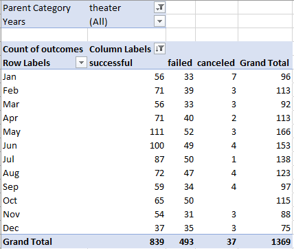

# Kickstarting with Excel

## Overview of Project

### Purpose

The aim of this project was to help Louise gain a better understanding of what lends itself to a successful Kickstarter fundraising campaign, particularly when it comes to putting on a theatrical play. By taking a look at past projects on the Kickstarter platform, we can help Louise create a realistic fundraising goal backed by data to increase her chances of success.

## Analysis and Challenges

### Analysis of Outcomes Based on Launch Date
First, I took a look at the impact that launch date has on a Kickstarter campaign. The first challenge was getting a date that is easily understood at a glance. The initial dataset used a Unix timestamp for the deadline and date launched information, which is not ideal for a visualization. By using the formula `=(((J522/60)/60)/24)+DATE(1970,1,1)` where J522 refers to our Unix date, we divide by seconds, minutes, and hours, and add the Unix start date of Jan 1st 1970 to get the date-time in a human-readable format. From here, using the `=YEARS()` formula, we can extract just the year to aid in our pivot analysis.
	Now that we have the data in a more user-friendly format, creating a pivot is a good way to see what time of year is ideal for a theater project. Setting up the pivot like so:
	

We can then easily chart the results to see what time of the year is most effective to launch a Kickstarter campaign to fund a play.

### Analysis of Outcomes Based on Goals
Another way to slice the data is to take a closer look at the dollar amounts of the fundraising goals themselves. To do this, splitting the goals into buckets based on their dollar targets allows us to see what can realistically be funded by appealing to Kickstarter backers. I set up the groupings like so:
PIC
This allows us to see if a lower dollar target equates to a higher successful Kickstarter rate, but unfortunately the syntax of “1000 to 4999” doesn’t help us to work with formulas. To avoid this problem, I’ve created a “Min Range” and “Max Range” column that numerically shows the bottom and top end of each bucket, so they can be used in formulas. Splitting those values into cells and removing the text allows for a formula like so:
`=COUNTIFS(Kickstarter!F:F,"=Successful",Kickstarter!R:R,"=plays",Kickstarter!D:D,">="&'Outcomes Based on Goals'!B2,Kickstarter!D:D,"<="&'Outcomes Based on Goals'!C2)` 
Where column B has the minimum value, column C has the maximum value, and then “=Successful” can be substituted out for failed and canceled to find the total count of each completion condition.

## Results
#### What are two conclusions you can draw about the Outcomes based on Launch Date?
Taking a look at the Outcomes by Launch Date graph, we can see a spike in successes in May, that falls a bit each month as the year goes on. It appears that May through July are ideal for launching a theater project on Kickstarter, as those months have the highest number of successes historically. One thing to note though, is the graph is displaying raw numbers of successes, so if we take into account the total number of campaigns, we see that those months also have the highest number of attempts, success or otherwise. Switching the “outcomes” value in the pivot to display “% of Row Totals” shows us that those months also have higher percentage success rates too though, at 66.87%, 65.36%, and 63.04% for May, June, and July respectively. If we toggle the parent category on this pivot to contain all, and not just theater, we can also see that Theater’s overall success rate of 61.29% is higher than the 53.76% success for all types of campaigns. Ultimately, we can conclude that late spring to mid-summer is a good time to launch a theater project on Kickstarter, and in general theater has a decent success rate when compared to all other projects on Kickstarter. 

#### What can you conclude about the Outcomes based on Goals?
Looking at the outcomes based on goal dollar amount, we can see that the goals under $1000, and between $1000 and $4999 are by far the most likely to succeed. They are both around 75% successful, and drop off significantly once the target goal dollar amount increases from there. While there is another seeming spike in success rate from $35000 to $39999 and $40000 to $44999, the sample size for those two buckets is 6 and three respectively. That is far too low to make any sort of prediction of a chance of success at those goal earnings targets.
#### What are some limitations of this dataset?
The total number of Kickstarter data points could be a bit of a limitation, as more data is always preferable when making decisions like those surrounding Louise’s dreams for putting on a play. The data ends at 2017 as well, which some more recent data would be useful – without it we don’t know whether plays still see fundraising success on Kickstarter, or whether the platform still gets enough attention to be a viable source of crowdfunding.
#### What are some other possible tables and/or graphs that we could create?
Creating a table or chart to take a look at the relationship between project type, number of backers, average donation, and success rate would be interesting. A play for example might rely on a smaller number of high donations from passionate individuals, whereas something with a bit wider appeal such as television or video games might attract a higher backer base, but at lower donations per backer. It would be interesting to see how the success rates differ across these different approaches towards funding. 
